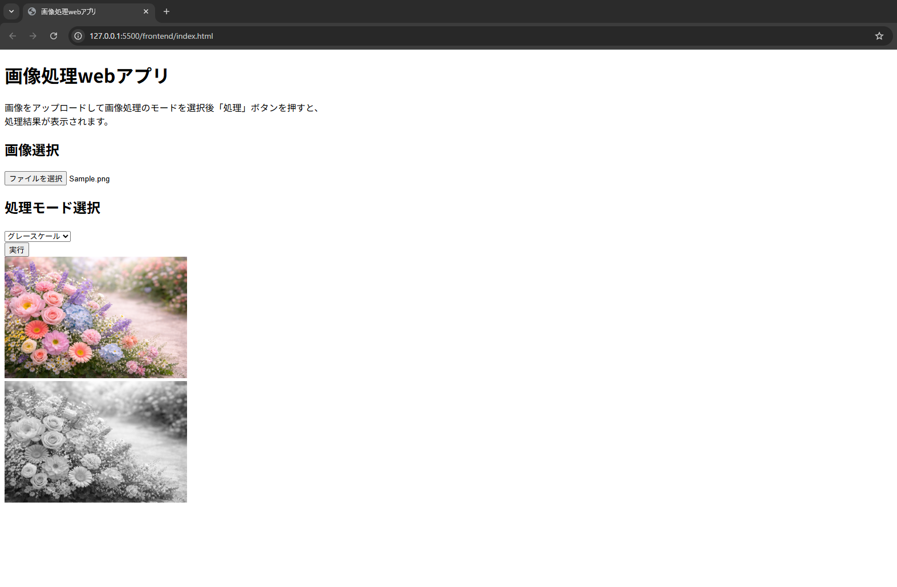

# 画像処理Webアプリ（FastAPI + OpenCV） - MVP

ブラウザで画像を選択し、処理モード（グレースケール / ぼかし / 左右反転）を選んで実行すると、バックエンド（FastAPI + OpenCV）が画像処理を行い、結果画像（PNG）を返して画面に表示する **簡易画像処理Webアプリ** です。

> 目的：APIを使ったバックエンド（FastAPI）の実装練習 + 最小構成で動く画像処理Webアプリを作る。


---

## ブラウザ 動作画面




## 機能

- 画像アップロード（ブラウザ）
- 処理モード選択
  - `gray`：グレースケール
  - `blur`：ぼかし（GaussianBlur）
  - `flip`：左右反転（OpenCV flip）
- 処理結果の表示（APIレスポンス `image/png` を `blob` で表示）
- 最低限のエラーハンドリング
  - ファイル未選択ガード（フロント）
  - 画像デコード失敗 / 未対応拡張子 / サイズ超過（バックエンド）
  - 実行中の連打防止（busy制御）

---

## 技術スタック

- Backend：Python / FastAPI / OpenCV（opencv-python）/ NumPy
- Frontend：HTML / JavaScript（fetch + FormData）
- Dev：VS Code（Live Server推奨）

---

## フォルダ構成


```
.
├─ backend/
│  ├─ main.py          # FastAPIエンドポイント
│  └─ proc.py          # 画像処理コア（OpenCV）
└─ frontend/
   ├─ index.html
   └─ js/
      └─ main.js
```

---

## セットアップ

### 前提
- Python 3.10+（目安）
- VS Code（任意。Live Server を使うと楽です）

### 依存ライブラリのインストール

`requirements.txt` を用意している場合：
```bash
pip install -r requirements.txt
```

---

## 起動方法（ローカル）

### 1) バックエンド（FastAPI）起動

リポジトリルートで：

```bash
uvicorn backend.main:app --reload --host 127.0.0.1 --port 8000
```

- API：`http://127.0.0.1:8000/api/process-image`
- Swagger UI：`http://127.0.0.1:8000/docs`

### 2) フロントエンド起動

- `index.html` を Live Server で開く（推奨）
  - 例：`http://127.0.0.1:5500`

---

## 使い方

1. 画像ファイルを選択
2. 処理モードを選択（グレースケール/ ぼかし / 左右反転）
3. 「実行」ボタンを押す
4. 下側に処理結果が表示されます

---

## 入力制限（バックエンド）

- 許可するContent-Type（例）
  - `image/png`, `image/jpeg`, `image/webp`, `image/bmp`, `image/tiff`
- サイズ上限：5MB（`413` を返します）

> 制限値や許可形式は `main.py` 側の設定（例：`ImgConfig`）に依存します。

---

## API仕様（MVP）

### `POST /api/process-image`

- Content-Type：`multipart/form-data`
- Form fields：
  - `file`：画像ファイル
  - `mode`：`gray` / `blur` / `flip`

**レスポンス（成功）**
- `200 OK`
- `Content-Type: image/png`
- Body：PNGバイナリ（処理結果画像）

**レスポンス（失敗例）**
- `400 Bad Request`
  - `empty file`
  - `not allowed image extension`
  - `failed to decode image`
  - `unknown proc_type: ...`
- `413 Payload Too Large`
  - `file size is over 5MB`
- `500 Internal Server Error`
  - `encode error: processed image`

---

## 実装メモ（現状の仕様）

- 画像は OpenCV でデコードして処理します
- `blur` のカーネルサイズや `flip` の方向は現状「固定パラメータ」になっています  
  → 今後、フロント入力→APIパラメータ受け取り→バリデーション、を追加予定

---

## 今後のTODO（Roadmap）

- [ ] modeごとのパラメータ入力（例：blurのksize、flipのdirection）をAPIで受け取る
- [ ] エラーをJSON形式で統一（フロントで扱いやすくする）
- [ ] logging / trace_id の導入（原因追跡しやすくする）
- [ ] テスト追加（procのユニットテスト、APIの結合テスト）
- [ ] Docker化（任意）

---

## CHANGELOG

- `CHANGELOG_mod.md` を参照（Mod単位で更新履歴を記録）

---


